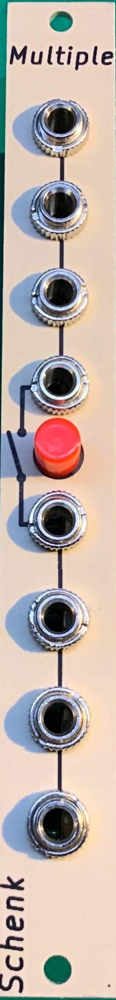

<picture>
  <source media="(prefers-color-scheme: dark)" srcset="docs/images/logo-light.png">
  
</picture>

# Passive Multiple

A 3HP Eurorack passive multiple from **Schenktronics**. It has two banks of four jacks and a latching pushbutton that links the banks into one 8-jack multiple. It needs no power.



## Features

- 3HP Eurorack, 15 mm deep, and it needs no power
- 2 × 4-jack banks, or 1 × 8 when linked
- A latching link button between the banks: in = linked, out = split
- The whole kit is through-hole, with 30 solder joints

## Documentation

| Document | For | PDF |
|----------|-----|-----|
| [User Manual](docs/manual.md) | Using the module | [PDF](docs/pdf/passive-multiple-manual.pdf) |
| [Assembly Guide](docs/assembly-guide.md) | Building the kit | [PDF](docs/pdf/passive-multiple-assembly-guide.pdf) |
| [Bill of Materials](docs/BOM.md) ([CSV](docs/BOM.csv)) | Parts and sourcing | |

## Repository layout

```
PassiveMultiples/            Main PCB (KiCad 5.1)
  PassiveMultiples.sch         Schematic
  PassiveMultiples.kicad_pcb   PCB layout
  PassiveMultiples.step        3D model
  Gerbers/, *Gerbers.zip       Fabrication files
  BOM.ods                      Original BOM spreadsheet
PassiveMultiplesFaceplate/   Faceplate (KiCad 5.1, made as an aluminium PCB)
  PassiveMultiplesFaceplate.dxf  Panel outline and drill drawing
  Gerbers/, *Gerbers.zip         Fabrication files
docs/                        Manual, assembly guide, BOM, images
  drawings/                    Scripts that generate the drawings
  pdf/                         PDF versions and their build settings
```

## Fabrication

| Board | Size | Layers | Thickness | Notes |
|-------|------|--------|-----------|-------|
| Main PCB | 15 × 100 mm | 2 | 1.6 mm | Standard green is fine |
| Faceplate | 15 × 128.5 mm | 1 | 1.6 mm | Aluminium PCB, white solder mask, black silkscreen. Only the front copper layer is used, so FR4 works too. |

Upload the matching `*Gerbers.zip` to any common PCB fab.

## License

This hardware design and its documentation are licensed under [CC BY-NC-SA 4.0](https://creativecommons.org/licenses/by-nc-sa/4.0/). See [LICENSE](LICENSE).

The Schenktronics name and logo are trademarks of Nathan Schenk and are not covered by the CC BY-NC-SA 4.0 license.

## Links

- Tindie: <https://www.tindie.com/products/schenktronics/passive-multiple/>
- ModularGrid: <https://modulargrid.net/e/schenktronics-multiple>
- Build video: <https://www.youtube.com/watch?v=nGc3uMlrRig>
- Website: <https://schenktronics.com>
