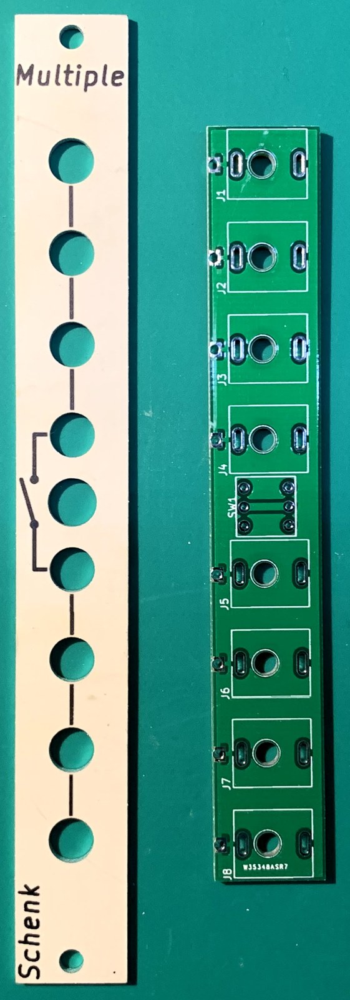
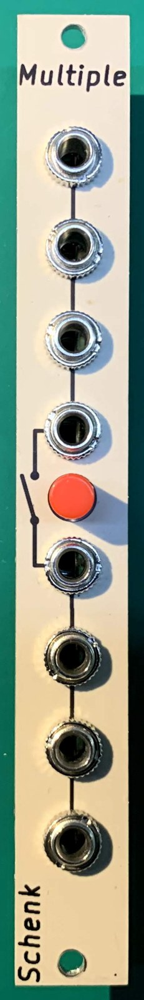

# Passive Multiple — Assembly Guide

Building this kit takes about 20–30 minutes and needs 30 solder joints. It is a good first Eurorack kit.

## What you need

### Kit contents

Check your kit against this list before you start (full details in the [BOM](BOM.md)):

- [ ] 1 × main PCB
- [ ] 1 × faceplate
- [ ] 8 × 3.5 mm jacks with nuts
- [ ] 1 × pushbutton switch (APEM MHPS2285)
- [ ] 1 × button cap

### Tools

- Soldering iron (about 330–360 °C for leaded solder)
- Solder
- Flush cutters
- Multimeter with a continuity (beep) mode
- Nut driver or wrench for the jack nuts (optional, but it avoids scratching the panel)

## Before you start

- The jacks and switch go on the **front** of the PCB, which is the side with the part outlines (J1–J8, SW1). The side printed "Passive Multiple v1.0 / schenktronics.com" is the back, and you solder there.
- You solder the switch first. **Do not solder the jacks until the faceplate is fitted.** The faceplate holds the jacks in line, and fitting it lets you center the button in its panel hole.

## Step 1 — Solder the switch

1. Insert the switch's six pins into the 2 × 3 SW1 footprint from the front of the PCB. It works either way round, because the footprint is wired symmetrically.
2. Hold it flat against the PCB and square to the board, then solder one pin from the back.
3. Check that the switch still sits flat and straight. If it doesn't, reheat that pin and adjust it.
4. Solder the other five pins. Work quickly so you don't overheat the plastic switch body.
5. Trim the leads with flush cutters.

## Step 2 — Fit the button cap

Press the button cap onto the switch plunger. Press the button a few times to check that it latches in and releases.

## Step 3 — Fit the jacks and faceplate

1. Insert all eight jacks into J1–J8 from the front of the PCB. Make sure each jack sits flat, with all three legs through their pads. Do not solder them yet.
2. Remove the nuts from the jacks.
3. Lower the faceplate over the jacks. The "Multiple" label goes at the top, next to J1, and the button goes through the larger hole between the two banks.
4. Put the nuts back on and tighten them **finger-tight** for now.
5. Shift the PCB until the button is **centered in its panel hole** and presses in and out without rubbing. The jack legs have a little play in their pads, which gives you room to adjust.
6. Tighten the nuts snugly. Do not overtighten them, because that can crack the jack threads or mark the panel. Then check the button again.

## Step 4 — Solder the jacks

Turn the assembly over and solder from the back of the PCB.

1. On each jack, solder one leg only. Then check again that the button is centered and moves freely. If it doesn't, reheat those joints and adjust.
2. Solder all the remaining jack legs (24 joints in total).
3. Trim any long leads with flush cutters.

Inspect every joint. Each one should be shiny and cone-shaped, with no bridges between neighboring pads.

## Step 5 — Test

Test with a multimeter in continuity mode. No power is needed. The "tip" contact is the one that touches the tip of a plugged-in cable; testing is easiest with two patch cables plugged in, probing their plugs.

| Test | Expected result |
|------|-----------------|
| Sleeve of any jack ↔ sleeve of every other jack | Beep |
| Tip ↔ tip, within Bank A (top four) | Beep |
| Tip ↔ tip, within Bank B (bottom four) | Beep |
| Tip of Bank A ↔ tip of Bank B, button **in** | Beep (linked) |
| Tip of Bank A ↔ tip of Bank B, button **out** | No beep (split) |
| Tip ↔ sleeve, any jack, either button position | **No beep.** A beep means a short. Check for solder bridges. |

## Step 6 — Install

Install the module in your case with two M3 screws. Usage details are in the [User Manual](manual.md).

## Troubleshooting

| Symptom | Likely cause |
|---------|--------------|
| One jack is dead | That jack has a cold or missing solder joint. Reflow its tip and sleeve legs. |
| The banks never link, or never split, when the button is pressed | There is a bad joint on the switch, or the switch is not fully seated. Reflow the six switch pins. |
| The signal is shorted to ground | There is a solder bridge between a tip pad and a sleeve pad. |
| The button rubs or sticks | The button is not centered in its panel hole. Loosen the nuts, reheat the jack joints, and shift the PCB until it is centered. |
