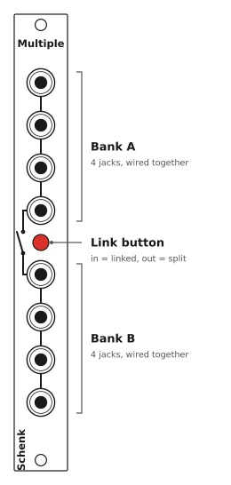
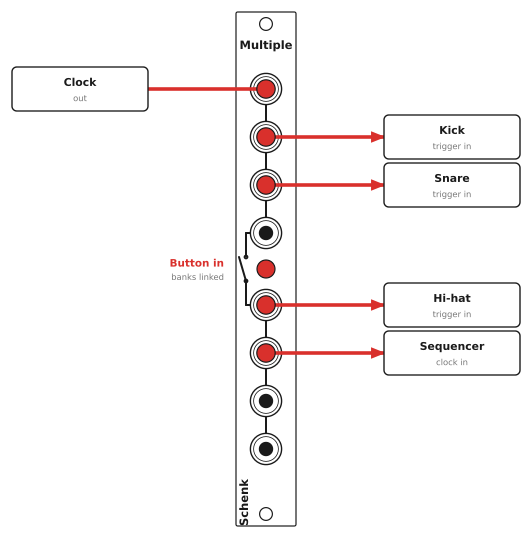
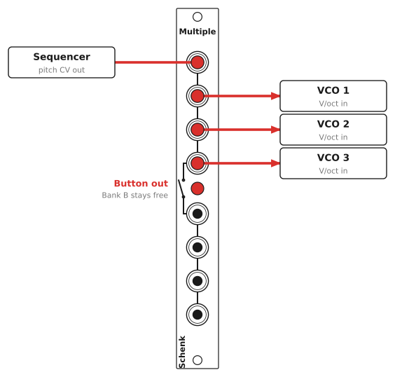
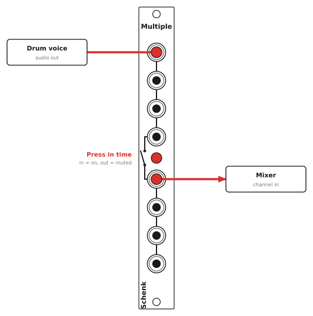
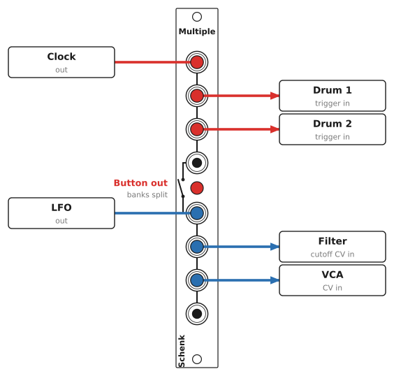

# Passive Multiple — User Manual

## Overview

The Passive Multiple is a 3HP Eurorack utility module with eight jacks in two banks of four. All jacks in a bank are wired together, so one signal in a bank goes out of the other three jacks. The red button links the two banks, making one 8-jack multiple.

The module has no electronics beyond the jacks and the switch, so it does not need power.

## Specifications

| | |
|---|---|
| Format | Eurorack, 3HP |
| Panel | 15 × 128.5 mm |
| Depth | About the height of the jacks (skiff-friendly) |
| Power | None needed |
| Jacks | 8 × 3.5 mm mono (TS) |
| Switch | Latching push-on/push-off button (in = linked), rated 0.1 A / 30 VDC |

## Panel layout

The lines printed on the panel show the connections: jacks joined by a line are wired together, and the switch symbol between the banks is the link button.

## Using the module

### Split mode (button out)

You get two separate 1-in, 3-out multiples. Patch one source into any jack in a bank and take copies from the other three jacks.

### Linked mode (button in)

All eight jacks are wired together, giving you 1 in and 7 out.

### Link button

The button is latching (push on, push off). When it is **in**, the banks are linked. When it is **out**, they are split.

### Using the button as a performance switch

The link button can also be played live. Patch a signal into Bank A and take it out of Bank B. The button then turns that signal on and off. Press it in time with the music to drop a part in and out, mute a modulation source, or cut a clock or gate stream.

You can do this while still using both banks as multiples. Any other jacks in Bank A always carry the signal. The jacks in Bank B only carry it while the button is in.

When the button is out, the Bank B jacks aren't connected to anything, so the modules patched from them get no signal. With audio, you may hear a small click when you switch. The switch changes sharply, so it works best on rhythmic material.

### Signals in any direction

The jacks have no set inputs or outputs, so any jack works as either. You can also use a bank backwards: connect several inputs to one output, or connect one cable to a cable that is too short.

## Patch examples

Each drawing shows the module that sends the signal on the left and the modules that receive it on the right. Any jack in a bank works; the drawings just use the first free ones.

### One clock to four modules

Patch a clock into Bank A and press the button in. All seven other jacks now carry the clock, so up to seven drum voices, sequencers or clock dividers stay in time. If you only need three copies, leave the button out and use Bank A alone.

### Pitch to three oscillators

Send one sequencer's pitch CV to three VCOs and they play the same notes. Detune them slightly for a thick unison sound, or set them to different octaves. Leave the button out so Bank B stays free for something else. A passive multiple can pull pitch CV slightly out of tune (see [Good practice](#good-practice)), so check the tuning once everything is patched.

### Performance mute

Patch a signal into Bank A and take it out of Bank B, as described in [Using the button as a performance switch](#using-the-button-as-a-performance-switch). Press the button in time with the music to drop the part in and out of the mix. This works well for drums, gates and modulation.

### Two separate multiples

With the button out, the module is two separate 1-in, 3-out multiples. Here Bank A spreads a clock to two drum voices, and Bank B sends one LFO to both a filter's cutoff and a VCA, so they move together. Don't press the button in this patch: it would connect the clock and the LFO outputs together.

## Good practice

- **Use one output per bank.** Connecting two module outputs to the same bank (or to linked banks) shorts them together. Most Eurorack outputs have protection resistors and survive this, but the signal you get is meaningless. It is also the most common patching mistake with a multiple.
- **Pitch CV (V/oct):** A passive multiple has no buffering. Most inputs have high impedance, so the load is small, but spreading one pitch CV across many oscillators can drop the voltage slightly and put them a little out of tune. If tuning matters, use a buffered multiple or check the tuning after patching.
- **Audio and gates** work fine through a passive multiple.
- **Grounds:** the sleeves of all eight jacks are wired together, in both modes.

## Installation

1. Power off your case. The module does not need power, but you should never work in a powered case.
2. Place the module in any 3HP space. There is no ribbon cable to connect.
3. Secure it with two M3 rack screws. Do not overtighten them.

## Circuit

Each jack's tip is wired to the other tips in its bank, and all sleeves are wired together. The two poles of the switch are wired in parallel between the Bank A tips and the Bank B tips. The schematic is in [PassiveMultiples/PassiveMultiples.sch](../PassiveMultiples/PassiveMultiples.sch) (KiCad 5).
